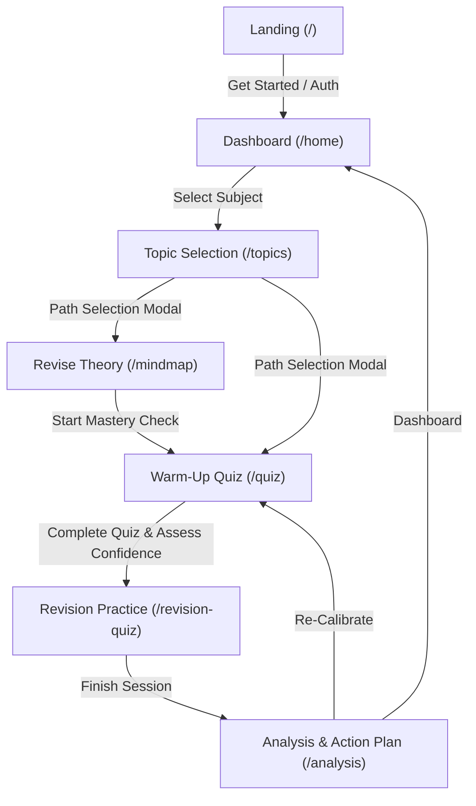

# ReviseIt Codebase Analysis

Welcome to the ReviseIt project analysis. This document details the application architecture, user flows, database/data structure, configuration details, and initial bug findings.

---

## 🛠️ Technology Stack
* **Frontend Core:** React 19 + Vite
* **Styling:** Tailwind CSS V4 (with `@tailwindcss/vite` integration) + Vanilla CSS base layers in [index.css](file:///d:/Code%20playground/ReviseIt/src/index.css)
* **Routing:** React Router DOM V7
* **Flowcharts & Mapping:** XYFlow (React Flow) for rendering nodes, styled using Dagre library for automatic layout (vertical for desktops, horizontal for mobiles).
* **Mathematics Rendering:** KaTeX + custom wrapper in [Latex.jsx](file:///d:/Code%20playground/ReviseIt/src/components/Latex.jsx)
* **Icons:** Lucide React
* **Toast Alerts:** React Hot Toast
* **Backend & Auth:** Firebase Auth integration using custom context in [AuthContext.jsx](file:///d:/Code%20playground/ReviseIt/src/context/AuthContext.jsx)

---

## 📂 Project Structure

```
ReviseIt/
├── public/
│   ├── data/
│   │   ├── manifest.json              # List of available subjects & chapters
│   │   ├── physics/                   # Physics data subfolders (flashcards, mindmaps, questions)
│   │   ├── chemistry/                 # Chemistry data subfolders
│   │   └── maths/                     # Mathematics data subfolders
│   └── diagrams/                      # Concept diagrams
├── src/
│   ├── components/
│   │   ├── landing/                   # Subcomponents for Landing Page
│   │   ├── Landing.jsx                # Main landing container page
│   │   ├── Home.jsx                   # Subject dashboard page
│   │   ├── TopicSelection.jsx         # Chapter selection and starting path modal
│   │   ├── Mindmap.jsx                # Interactive XYFlow theory map & flashcard popup
│   │   ├── QuizView.jsx               # The "Reality Check" baseline diagnostic quiz
│   │   ├── RevisionQuizView.jsx       # The main adaptive revision practice quiz
│   │   └── SessionAnalysisView.jsx    # Session analysis, rank feedback, action plans
│   ├── context/
│   │   └── AuthContext.jsx            # User state provider
│   ├── firebase/
│   │   └── config.js                  # Firebase configuration
│   ├── utils/
│   │   └── dataLoader.js              # Dynamically loads manifest & subject JSON data
│   ├── App.jsx                        # Routing, theme setup, and layout wrapper
│   └── index.css                      # Styling definitions and CSS theme variables
├── JSONformatter.py                   # Python script for formatting raw formulas to LaTeX syntax
└── OptionCleaner.py                   # Python script for cleaning option letters and markers
```

---

## 🔄 Core User Flow & Router Mappings

The application centers around a single, distraction-free adaptive revision loop:



### 1. Subject Dashboard (`/home`)
Handled by [Home.jsx](file:///d:/Code%20playground/ReviseIt/src/components/Home.jsx). Users select from three key domains: **Physics**, **Chemistry**, or **Maths**. 

### 2. Topic/Chapter Selection (`/topics`)
Handled by [TopicSelection.jsx](file:///d:/Code%20playground/ReviseIt/src/components/TopicSelection.jsx). It loads available modules from [manifest.json](file:///d:/Code%20playground/ReviseIt/public/data/manifest.json) using the asynchronous utilities in [dataLoader.js](file:///d:/Code%20playground/ReviseIt/src/utils/dataLoader.js). When a user clicks a topic, a **Path Selection** modal prompts them to choose their entry point:
* **Option A: Revise Theory:** Renders an interactive XYFlow node map of the subtopics.
* **Option B: Warm-Up Quiz:** Direct entry into the diagnostic test.

### 3. Theory Revision (`/mindmap`)
Handled by [Mindmap.jsx](file:///d:/Code%20playground/ReviseIt/src/components/Mindmap.jsx).
* Generates hierarchical nodes (`root`, `topic`, `subtopic`) laid out automatically by the `dagre` layout library.
* Clicking any **Subtopic** node opens the **FlashcardModal** containing formulas, key questions, visual aids/diagrams, and fast recall flashcards.
* Bottom navigation contains a call-to-action button: `"START MASTERY CHECK"`, which transitions the user to the Warm-Up Quiz.

### 4. Warm-Up Quiz / The Reality Check (`/quiz`)
Handled by [QuizView.jsx](file:///d:/Code%20playground/ReviseIt/src/components/QuizView.jsx).
* Pulls exactly **5 foundational (tag `'F'`) questions** chosen at random from the chapter's pool.
* Acts as the baseline diagnostic.
* Upon finishing, the user is prompted to rate their self-assessed confidence level on a scale of **1 to 5**.
* Clicking `"Final Revision Session"` routes the user to the main adaptive revision module.

### 5. Adaptive Practice Session (`/revision-quiz`)
Handled by [RevisionQuizView.jsx](file:///d:/Code%20playground/ReviseIt/src/components/RevisionQuizView.jsx).
* Builds a pool of **10 questions** adaptive to the user's self-assessed confidence level:
  * **Low Confidence ($\le 2$):** $8\text{ Foundational} + 5\text{ Core} + 2\text{ Stretch}$ questions.
  * **Medium Confidence ($= 3$):** $4\text{ Foundational} + 8\text{ Core} + 3\text{ Stretch}$ questions.
  * **High Confidence ($\ge 4$):** $2\text{ Foundational} + 6\text{ Core} + 7\text{ Stretch}$ questions.
* The quiz supports:
  * Option selection and manual submission.
  * `"Mark"` for review (visual tracking in the grid navigator).
  * `"Clear"` answer state.
  * `"Show Concept"` panel displaying the `"shortExplanation"` or `"Synaptic Bridge"` for immediate feedback.

### 6. Calibration & Analysis (`/analysis`)
Handled by [SessionAnalysisView.jsx](file:///d:/Code%20playground/ReviseIt/src/components/SessionAnalysisView.jsx).
* Computes the score percentage.
* Maps performance to a **Reality Level** (1–5) and compares it side-by-side with the user's **Self Map** rating.
* Shows JEE-focused impact feedback (e.g. rank changes, positive vs negative marking warnings).
* Prescribes a structured study calendar action plan based on performance gaps.

---

## 🔍 Critical Bug Discovered

During codebase inspection, an adaptive routing logic bug was identified:

### Prop Mismatch in `RevisionQuizView` Routing
* **In [App.jsx](file:///d:/Code%20playground/ReviseIt/src/App.jsx#L147):**
  ```jsx
  <Route path="/revision-quiz" element={selectedTopic ? <RevisionQuizView chapter={selectedTopic} confidence={userConfidence} onBack={() => navigate('/quiz')} onComplete={handleCompleteRevision} /> : <Navigate to="/home" replace />} />
  ```
  The prop passed to indicate the user's confidence rating is named **`confidence`**.
* **In [RevisionQuizView.jsx](file:///d:/Code%20playground/ReviseIt/src/components/RevisionQuizView.jsx#L20):**
  ```jsx
  const RevisionQuizView = ({ chapter, initialConfidence, onBack, onComplete }) => {
  ```
  The component declares the prop parameter as **`initialConfidence`**.
* **Impact:** Since `initialConfidence` evaluates to `undefined`, the adaptive pool selection checks (`initialConfidence <= 2`, `initialConfidence === 3`) fail, causing the system to fallback to the `else` block (High Confidence) for all users regardless of their diagnostic confidence. We will resolve this in our first plan.

---

## 🛠️ Internal Formatting Scripts
The repository includes two Python scripts located in the root to help process text in question JSON files:
1. **[JSONformatter.py](file:///d:/Code%20playground/ReviseIt/JSONformatter.py):** Parses JSON string attributes to wrap math operators, Greek letters ($\theta, \lambda, \Delta$, etc.), and standard metrics (like $\text{m/s}^2$) in KaTeX formatting ($...$).
2. **[OptionCleaner.py](file:///d:/Code%20playground/ReviseIt/OptionCleaner.py):** Cleans option labels (e.g., stripping prefixes like `(a)`, `A.`, or `Option B: `) to prevent redundant letters from rendering in options fields.
